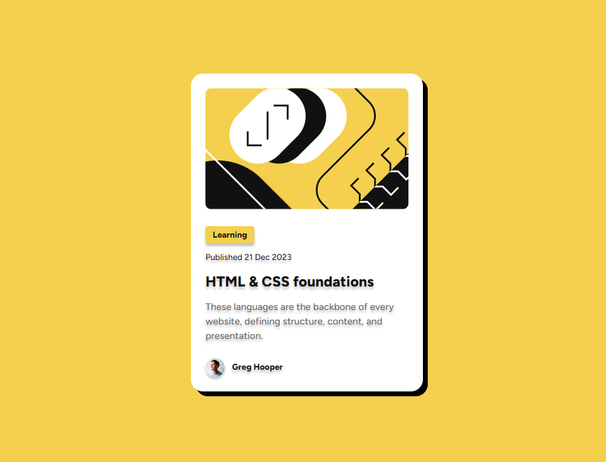

# Frontend Mentor - Blog preview card solution

This is a solution to the [Blog preview card challenge on Frontend Mentor](https://www.frontendmentor.io/challenges/blog-preview-card-ckPaj01IcS). Frontend Mentor challenges help you improve your coding skills by building realistic projects. 

## Table of contents

- [Overview](#overview)
  - [The challenge](#the-challenge)
  - [Screenshot](#screenshot)
  - [Links](#links)
- [My process](#my-process)
  - [Built with](#built-with)
  - [What I learned](#what-i-learned)
  - [Continued development](#continued-development)
  - [Useful resources](#useful-resources)
- [Author](#author)
- [Acknowledgments](#acknowledgments)

**Note: Delete this note and update the table of contents based on what sections you keep.**

## Overview

### The challenge

Users should be able to:

- See hover and focus states for all interactive elements on the page

### Screenshot



### Links

- Solution URL: https://github.com/Liyyy9/FEM-blog-preview-card
- Live Site URL: https://liyyy9.github.io/FEM-blog-preview-card/

## My process

### Built with

- Semantic HTML5 markup
- CSS custom properties
- Flexbox

### What I learned

Things that I am proud of in my code.

#### 1. Implementing the `:root` selector in my code to create customizable presets that can be reused throughout the entire project.

```
:root {
    /* colors */
    --yellow: hsl(47, 88%, 63%);
    --white: hsl(0, 0%, 100%);
    --gray500: hsl(0, 0%, 42%);
    --gray950: hsl(0, 0%, 7%);

    /* font family */
    --font-family: 'Figtree', sans-serif;

    /* text presets */
    --text-preset-1: 800 1.5rem/1.5 var(--font-family);             /* Extra bold, 24px, 150% line height */
    --text-preset-2: 500 1rem/1.5 var(--font-family);               /* Normal, 16px, 150% line height */
    --text-preset-3: 500 0.875rem/1.5 var(--font-family);           /* Normal, 14px, 150% line height */
    --text-preset-3-bold: 800 0.875rem/1.5 var(--font-family);      /* Extra bold, 14px, 150% line height */
}
```
#### 2. Implementing `box-shadow` and `text-shadow` for the first time in my projects.

```
box-shadow: 0 0.25rem 0.5rem rgb(0, 0, 0, 0.5);
text-shadow: 0 0.25rem 0.5rem rgb(0, 0, 0, 0.5);
<!-- syntax: offset-x offset-y blur-radius color -->
```

#### 3. Implementing `box-shadow` to a circular image by setting `border-radius: 50%`.

```
border-radius: 50%;
box-shadow: 0 0.25rem 0.25rem rgb(0, 0, 0, 0.25);
```

#### 4. Implementing `transition` to shadows.

```
transition: all 0.5s ease-in-out;
```

#### 5. Changing cursor to pointer.

```
cursor: pointer;
```

### Continued development

In the future, I want to get better at using media queries and making my code clearer and easier to manage. I’m aware that I still struggle with creating responsive designs and need to work on organizing my code and using consistent naming so it’s easier to read and update.

I also plan to focus on improving accessibility, making sure my projects are usable for everyone, including people with disabilities. Additionally, I’ll work on optimizing performance and keeping up with the latest web development trends. By practicing more and getting feedback from the developer community, I hope to keep improving and create better, more efficient, and accessible work.

### Useful resources

- https://developer.mozilla.org/en-US/docs/Web/CSS/transition - This link was really helpful in understanding transitions and how to incorporate them into my code.

## Author

- GitHub - [Liyyy9](https://github.com/Liyyy9)
- Frontend Mentor - [@Liyyy9](https://www.frontendmentor.io/profile/Liyyy9)

## Acknowledgments

A big thanks to everyone who shared their code on the community portal. I used several of them as references to help figure out the parts I was unsure about.